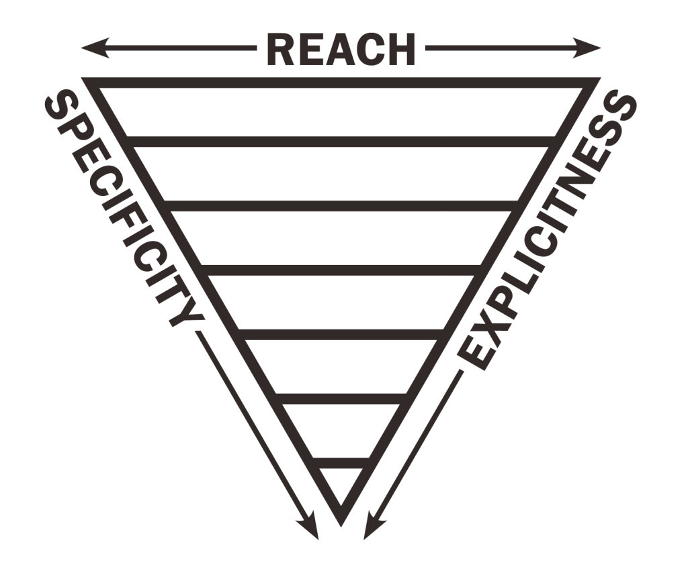

# Blueprint Framekit
[](https://www.repostatus.org/#wip)

> An framework-agnostic scalable sass-based css framework to streamline development of web tools in Fannie Mae's Digital Products portfolio and application frameworks like ADK. 

It is the web expression of the Blueprint Design System and Design Language. 

!! To run the kitchen dev previewer and to compile or build the system you will need SSH Key to be added to your profile in bitbucket


## Quick Start

1. In terminal, cd to directory of choice
2. Clone, by running `git clone ssh://git@bitbucket:7999/flk/cxd-ds-framekit.git`
3. Run `npm install` to get dependencies
4. `npm start`  To start complete system with watches and server

5. Note: on at least a weekly basis, make sure you run `npm update` to make sure that all of your modules (tokens etc. ) are updated


### Commands

```
gulp start
```
Maps & Builds toekns and SASS files. Runs the Kitchen previewer and starts watches for changes in all files. 
Files are placed in `build` folder. 


```
gulp build 
```

(default) Maps tokens from the tokens folder and all components folders and then converts into to the `_framekit-tokens.scss` file and places it in the  `src/globals/scss` folder. 
Also Maps SASS files in the toolkit global folders, components, utilities and then converts them into a `build` folder. 


### Browser Support
We aim to support browser who have global coverage of >1%. Its set in the package.json and you can test You can test the browser versions this cover here http://browserl.ist/?q=%3E%3D+1%25

### Feature Support
For Feature compatability and browser support see https://caniuse.com

## Framekit Structure

### Framekit follows a ITCSS flavor CSS architecture and is setup in the follow structure

#### End the Specificity Wars!

**Globals**: A container for assets that are used throughout the framekit. Ex: images, js, fonts, etc. 
**Globals/Settings**: Hold core Token and Framework variables, settings and config information
**Globals/Tools**:  Globally used mixins and functions
*---- First two layers are for pre-processors and should not output any CSS. ----*
**Base**: Normalize styles, box-sizing definition. Entire purpose here is to normalize native elements across browser so we have a standard canvas to work with.  (First layer to output css)
**Elements**: Bare global elements styling
**Objects** - class-based selectors defining undecorated design patterns.  Layout containers, grid, media object, etc. 
**Components** - Discrete, complete chunks of UI. Majority of the work happens here. 
**Utilities** - High-specificity, very explicit selectors, helper classes with the ability to override anything which goes before it above. !importants are allowed here. 

**Important Notes**
- The order of individual items in each layer does not (and should) matter. However the order of the layers themselves are important to prevent the dreaded specificity war
- Due to the above, the setting layer must be pure data and cannot depend on mixins or functions. 
- a FUTURE layer will include Theme layer

*** Adding Mixins close to context**
To enable the inclusion of mixins available to the whole system, but be included into the tools layer to ensure their availability through the import chain, prefix the file name with _tools.  and the build system will grab it and generate the @import with the tools. Remember these files should not output any CSS

### More about  ITCSS 
ITCSS stands for Inverted Triangle CSS and helps Blueprint organize CSS files in a way CSS global namespace,cascade and selector specificity.

**Why structure this way?** It allows us to take advantage of inheritance, instead of battling against just overwriting styles.  This reduces css we need to write and maintain. 

It also outputs effecient CSS thats clear and concise for developers ramping up later. Scaling is simple. Your adding code but not more complexity. 




> With this structure, you stop asking if your are styling a color or typography element but rather ask what is the scope of the element your working on. If its an element that appears elsewhere you know its towards the top of the stylesheet. If its a pattern appearing very specificially it will be towards the bottom. 

#### Key Concepts
1. Write CSS in specificity order
2. Make rules additive, not overiding.
3. Order imports following the triangle, starting with wide-reaching / low specificity and working towards low-reach / high-specificity rules 

#### Organize by these key metrics


#### Generic to explicit
Start with Most-generic, low-level and catch-all styles the move to more specific and explicit rules.  Ex: Start with a normalize, progress to ul, p, h1-6 through exlicit utilities like .u-align-right. 

#### Low specificity to high specificity
Lowest-specificity selectors appear towards the top, and then specificity increases slowly prgressing through the styles.  We avoid writing higher-specificity selectors before the lower ones.  

#### Far-reaching to localised
At the beginning selectors affect a large portion of the DOM and then that gets lessened as we go deeper. 


For more information on ITCSS, read https://www.xfive.co/blog/itcss-scalable-maintainable-css-architecture/


- `fk-` Components
- `u-` Utilities (then follows CTI naming)
- `t-` Themes
- `o-` Objects
- `l-` Layout / Objects  *consider* d- or o- 
- `js-` Classes witch influence behavior of an element through JS. This way we know explicitly where JS dependencies
- `qa-` Quality assurance styles
- `_` Outright Hacks
- `is- / has-` Temporary States. This is was JS can add and remove. 
- `env-` Enviroment


<section class="fk-section env-dark t-brand-blue"> </section> ???
<section class=" env-dark fk-section t-brand-blue"> </section> ???


**General Guidelines**

### Apply Margins in same direction, when possible. 
- Prefer applying margins to the bottom and right

## Applying spacing with 3 C's 
To help understand how to apply the Blueprint Spacing grid its broken down to **Containers, Content, Components**

### Containers
Are the frames of your UI and hold content. Ex: Pages, Cards, Modals, Tiles, etc.  

**Ideal Spacing to use**
Padding all around, using the inset, stretch, or squish spacing variables. 

> **NOTE**: containers are sometimes used to space out 

### Content
Content lives inside containers. Often mixed with data, examples are paragraphs, lists, forms, tables. Many are leaf-node hierarchy. 

**Ideal Spacing to use**
Margins to the bottom, using the stack spacing variables

**leaf-node types to solve for at Fannie Mae**
- Lists
- Tables
- Forms
- Paragraphs

> **NOTE**: These elements most often than not add margin collisions with line-height adding extra spacing. Effort is being made to solve all these with calculated measures via mixins. 

### Components
Are items like buttons, input fields, icons. They are often placed next to each other horizontally inline. 

**Ideal Spacing to use**
Margins to the right, using the line spacing variables.

> **NOTE**: Attempt to align components and type is perfectly on baseline grid and proportionately spaced to create hormonious aligned layout.  